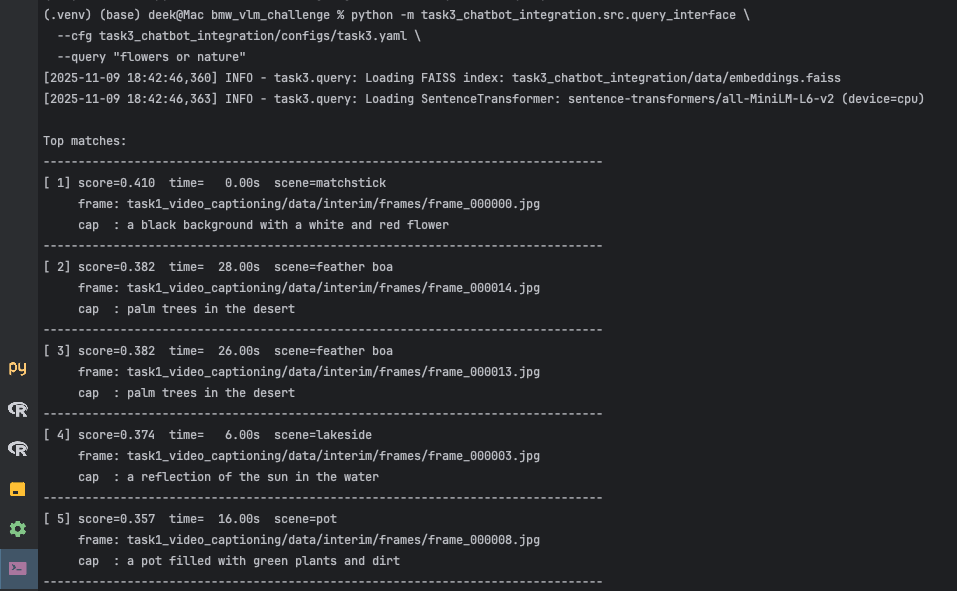
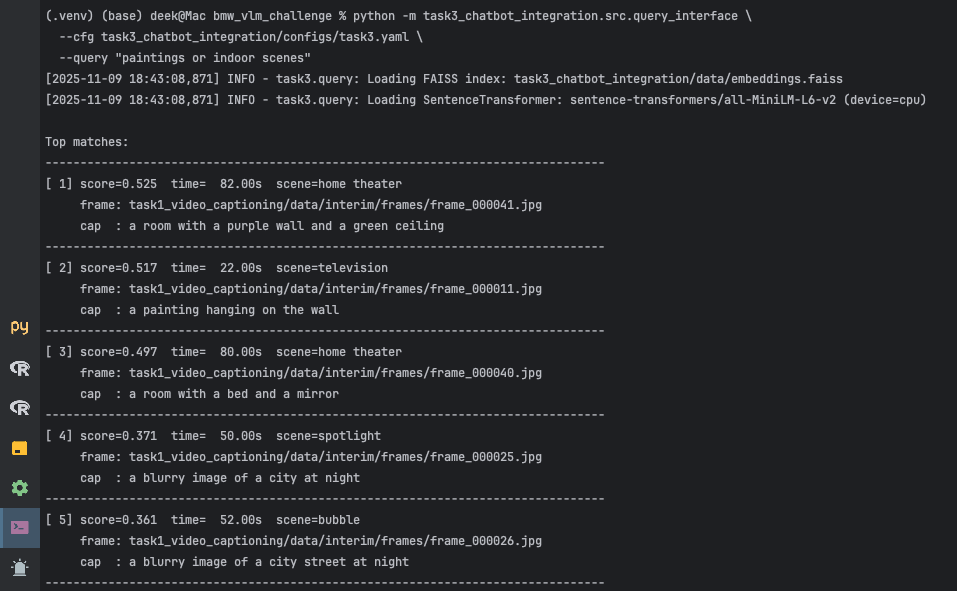

# Video Understanding with Vision–Language Models

A three-stage pipeline that turns a video into searchable metadata: BLIP captions the extracted frames, YOLOv8 and Places365 label what is in them and where they are set, and a sentence-transformers + FAISS index makes the whole thing answerable in natural language.

Built for a multimodal generative AI project and run end to end on CPU. The test input is a public YouTube video ("august" by Ink Ocean, 1:23) — deliberately an artistic one, which is where the models break in the most instructive ways.

## Semantic search over the extracted frames

Ask for a concept, get back the frames that match it — no keyword overlap with the captions required.

| "flowers or nature" | "paintings or indoor scenes" |
|---|---|
|  |  |

## Pipeline

```
video ─► frame_extraction_and_captioning/        OpenCV sampling ─► BLIP-base captions ─► Parquet
      ─► scene_classification_and_object_detection/  YOLOv8n objects + Places365 ResNet-18 scenes
                                                     ─► confidence gate, temporal smoothing, multi-crop
      ─► chatbot_integration/                     sentence-transformers embeddings ─► FAISS index ─► query
```

**Captioning.** BLIP-base over InstructBLIP or LLaVA, chosen for CPU inference within the compute budget and for having documentation good enough to debug against. Captions are written to Parquet so the later stages never re-run the model.

**Detection and scene classification.** YOLOv8n for objects, Places365 ResNet-18 for scene category. Both write per-frame records that the retrieval stage consumes.

**Retrieval.** Captions, objects and scene labels are merged into one text document per frame, embedded with sentence-transformers and indexed in FAISS, so queries match on meaning rather than on words the captioner happened to use.

## Where it fails, and what I did about it

The models were run on an artistic video precisely because that is where they misbehave. Three caption failure modes showed up in BLIP: a fishbowl captioned as "soup", nearly identical consecutive bridge frames captioned inconsistently, and a white wall read as "sand dunes" where the lighting and colour cast suggested one.

Places365 was worse. On street scenes it returned "scuba diver" and "fountain" with high confidence, which is the failure that matters most in a pipeline, since a confident wrong label propagates into the search index and poisons retrieval.

Three mitigations, all in `scene_classification_and_object_detection/`:

- A confidence threshold below which the prediction is written as `uncertain` rather than as its argmax, on the view that a labelled unknown is more useful downstream than a confident error.
- Temporal smoothing across neighbouring frames, which removes single-frame flips in scene category that the underlying video does not justify.
- Multi-crop evaluation, averaging predictions over crops so a single unlucky framing carries less weight.

YOLOv8 held up better, with reflective surfaces the main source of false positives.

## Setup

Python 3.10+.

```bash
python -m venv .venv
source .venv/bin/activate
pip install -r requirements.txt
python -c "import torch, transformers, ultralytics; print('ok')"
```

Model weights download on first run. `yolov8n.pt` is committed.

## Running

```bash
# Stage 1 — frame extraction and captioning
python -m frame_extraction_and_captioning.run_task1 all \
    --cfg frame_extraction_and_captioning/configs/task1.yaml

# Stage 2 — object detection and scene classification
python -m scene_classification_and_object_detection.run_task2 all \
    --cfg scene_classification_and_object_detection/configs/task2.yaml

# Stage 3 — build the index and query it
python -m chatbot_integration.run_task3 all \
    --cfg chatbot_integration/configs/task3.yaml
```

Each stage is configured by its own YAML and writes its output to disk, so stages can be re-run independently.

## Layout

```
vlm_blip_clip/
├─ common/                                       # shared I/O, logging, visualisation
├─ frame_extraction_and_captioning/              # stage 1: sampling + BLIP captions
├─ scene_classification_and_object_detection/    # stage 2: YOLOv8 + Places365
├─ chatbot_integration/                          # stage 3: embeddings, FAISS, query
├─ REPORT_NOTES.md                               # full write-up of the failure analysis
└─ requirements.txt
```

## Dependencies

| Library | Purpose |
|---|---|
| `opencv-python` | Frame extraction |
| `torch`, `torchvision` | Model runtime |
| `transformers` | BLIP-base captioning |
| `ultralytics` | YOLOv8 object detection |
| `sentence-transformers`, `faiss-cpu` | Embeddings and retrieval |
| `pandas`, `pyarrow` | Per-frame records in Parquet |
| `pyyaml` | Per-stage configuration |
| `matplotlib`, `tqdm` | Visualisation and progress |

## Limitations

Retrieval quality is not measured against a labelled ground truth — the query results shown above are illustrative, and a proper evaluation would need annotated frame-query pairs. Everything runs on CPU with the smallest viable checkpoints, so a larger captioner would likely remove several of the hallucinations described above rather than requiring the mitigations. Tested on a single short video.
