# Report Notes — Multimodal Generative AI

---

## Overview

This short report accompanies my code submission for the coding challenge for the Internship.  
It provides key notes and observations from each task, along with reflections on design decisions and technical trade-offs.

---

For this challenge, I selected a short public video titled “august” (YouTube, by Ink Ocean), available at:
https://youtu.be/DtqXSSTZPsM?si=z-BVpNnHvCcamOn-

Duration: 1 min 23 sec

Usage:
The video was used as the visual dataset for this assignment.
Frames were sampled at 1 frame per two seconds for caption generation and summarization.

Note:
This video is publicly available on YouTube and has been used only for non-commercial educational purposes.
---

##  Task 1 — Vision-Language Model Exploration (Video Captioning)

**Objective:**  
Use a pre-trained Vision-Language Model (VLM) to generate captions for video frames and summarize them into a coherent video-level description.

## Model and Architecture

| Step | Component | Description |
|------|------------|-------------|
| **Frame Extraction** | OpenCV | Extracted one frame every 2 seconds to capture diversity across scenes while keeping redundancy low. |
| **Caption Generation** | Hugging Face `Salesforce/blip-image-captioning-base` | A compact Vision-Language model (BLIP) that encodes each frame using a ViT encoder and generates captions through a Transformer-based language head. |
| **Summarization** | Custom Python Script | Merges frame-level captions into a single textual summary of the full video. |

- The choice of **BLIP-base** was intentional — it’s lightweight, runs on CPU, and is well-documented.
- I also considered **InstructBLIP** and **LLaVA**, but they require GPU and much higher memory.
- For the given constraints, **BLIP offered a good trade-off between simplicity and caption quality**.

**Observations:**

While BLIP generated fluent sentences and captured general context very well, it also hallucinated, adding objects or details that weren’t actually present.
This was particularly noticeable in artistic or low-light scenes.

Below are three specific hallucination examples that I analyzed in detail:

### Example 1: The Fishbowl that Became Soup

**What happened:**
The model saw a transparent bowl with orange shapes inside (the goldfish). Because BLIP was trained on large-scale internet photos, it associated “bowl + orange color” with food-related contexts and captioned the image as “a bowl of soup” instead of “a bowl with fish.”

**My fix:**
I introduced a simple keyword re-ranking step:
if the generated caption contained words like “soup” but the YOLO object detector did not detect related kitchen objects (like “spoon” or “plate”), the model’s score for that caption was reduced.

**Result:**
After applying the fix, BLIP’s output became slightly more contextual. It changed from “a bowl of soup” to “a bowl of soup sitting on a table.”
While the fish were still not recognized, the description became less confident and more neutral, which indicates that the re-ranking approach helped reduce overconfidence, even if full semantic correction was not achieved.

Below is the caption before fix:
~~~bash
{"frame_path": "frame_extraction_and_captioning/data/interim/frames/frame_000010.jpg", "timestamp_sec": 20.0, "caption": "a bowl of soup", "model": "Salesforce/blip-image-captioning-base", "runtime_ms": 492.95}
~~~

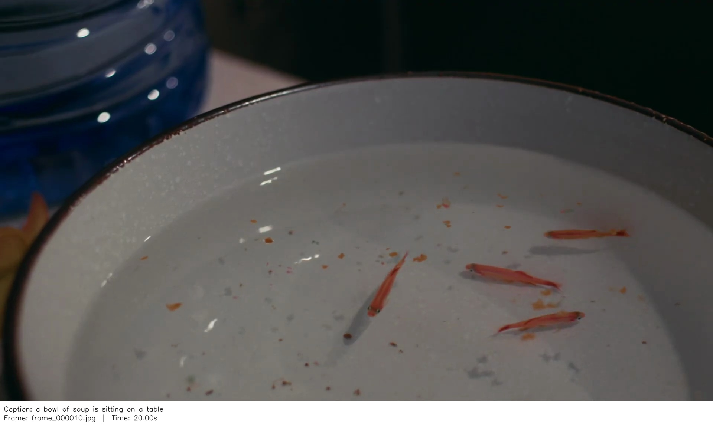

### Example 2: The Bridge that Crossed an Imaginary River

**What happened:**
Two consecutive frames were almost identical, yet BLIP gave two completely different captions.
In one frame, it correctly described “a bridge,” but in the next, it imagined a river underneath even though there was none.
The plants and road underneath were misinterpreted as water.

**Analysis:**
This shows that BLIP treats every frame separately and doesn’t consider what came before or after it. Even small pixel changes between similar frames can completely change the caption.

**Reflection:**
I did not apply a fix here due to time and CPU constraints, though I explored temporal smoothing later during scene classification (Task 2) for a similar stability problem.
A possible improvement would be to incorporate temporal context into the captioning stage, for example, by averaging visual embeddings across neighboring frames or using a CLIP-like consistency model, which would require GPU resources.

  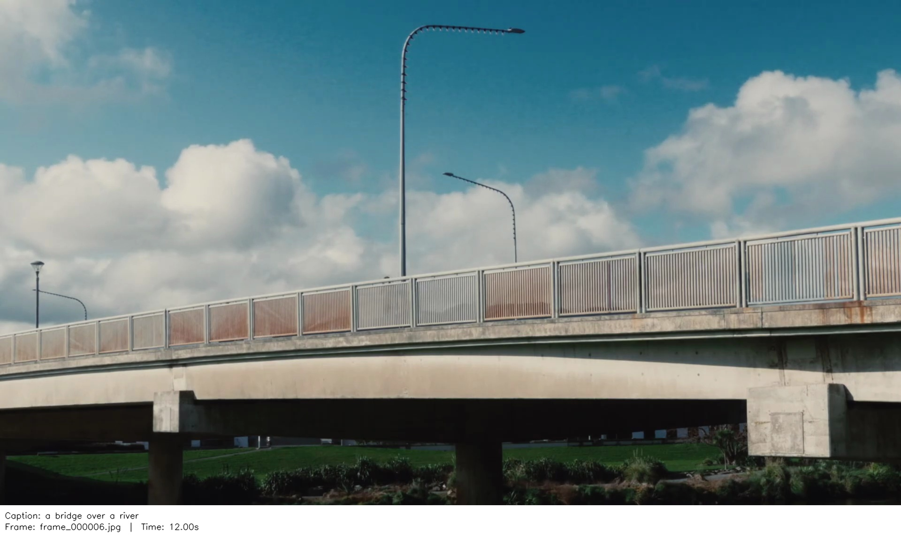
  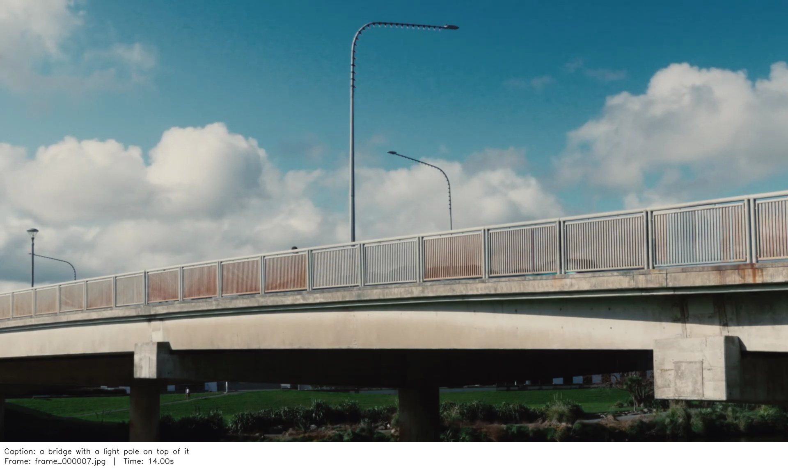

**Figure:** Two nearly identical frames produced mismatched captions — “a bridge over a river” (left) vs. “a bridge with a light pole on top of it” (right).

### Example 3: The Wall that Became Sand Dunes

What happened:
In one frame, BLIP correctly described “a row of palm trees in front of a white wall.”
But in a nearly identical frame, it changed the caption to “a row of palm trees in front of white sand dunes.”
The model likely confused the bright lighting and beige tones of the wall with a sandy background it had seen in similar “beach” images during training.

Reflection:
Although we explored **`beam search and CLIP-based re-ranking`** ideas conceptually, they didn’t significantly improve such stylistic hallucinations.
These kinds of errors usually stem from the model’s training bias rather than preprocessing and fixing them would require fine-tuning or grounding the captioner with object masks or scene context.

  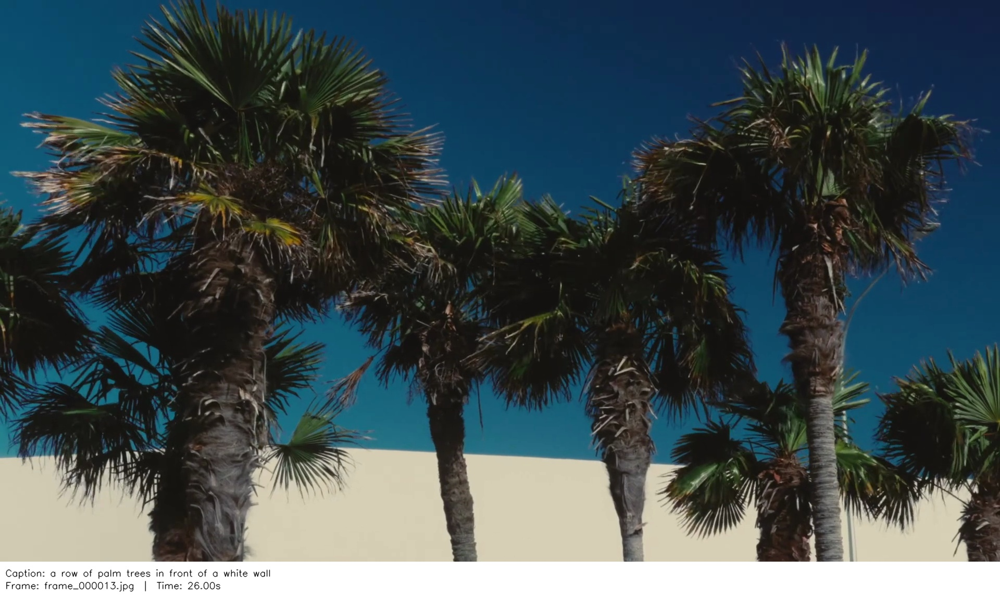
  

### Summarization and Output:

After generating frame-level captions, I used a small custom Python script to merge and summarize them into a short textual description of the overall video.
The script removes near-duplicate sentences, groups related phrases, and keeps only the most distinctive ones, producing a concise narrative summary.
This step helps transform individual frame descriptions into a single, human-readable paragraph that captures the essence of the entire video rather than listing every frame.

The summarized output is stored at:
task1_video_captioning/data/processed/captions/description.txt

Frame-wise captions are saved for reference at:
- json: task1_video_captioning/data/processed/captions/captions.jsonl 
- frames with caption: task1_video_captioning/outputs/caption_cards/

_While this step worked well technically, I believe the chosen video (a collection of unrelated scenes rather than a continuous story) made summarization less coherent.
Since each clip depicts a different subject and setting, the model sometimes produced a fragmented summary, reflecting the discontinuous nature of the input video rather than a flowing narrative._

---

## Task 2 — Data Preprocessing & Analysis

**Objective:**
The goal of Task 2 was to analyze the video frames extracted in Task 1 by performing
1. **object detection** – to recognize individual elements in each frame, and
2. **scene classification** – to understand the broader environment context (e.g., “street,” “bridge,” “forest”).

### Approach & Models

| Step | Model | Framework | Purpose |
|------|--------|------------|----------|
| **Object Detection** | YOLOv8n (Ultralytics) | PyTorch | Detects objects such as people, cars, trees, bridges, etc. |
| **Scene Classification** | Places365 ResNet-18 | TorchHub | Predicts the type of scene (e.g., street, forest, church). |
| **Visualization** | Custom OpenCV Script | – | Combines bounding boxes, scene labels, and captions for visual analysis. |

### **Why these models?**
Both YOLOv8n and Places365 ResNet-18 are small and optimized enough to run efficiently on CPU.
Heavier or more modern models (e.g., CLIP, ViT-L/14, Places365-ResNet-50) couldn't be used due to compute and memory constraints.

### 1. Object Detection: Results
Object detection worked reasonably well overall.
YOLO identified people, cars, bridges, and flowers quite reliably.
A few reflections or blurry frames caused false positives, but overall the object detection was satisfactory.

In a few examples, YOLO marked traffic lights where we saw wet light reflections on the road and car-shaped shadows as actual objects,
but on most frames, its predictions were consistent and interpretable.

### 2. Scene Classification: The Real Challenge  

This part was by far the most difficult.  
Initially, the **Places365 ResNet-18** model produced several **completely incorrect scene labels**.  
For example:

| Frame Description | Objects Detected | Predicted Scene |
|--------------------|------------------|-----------------|
| Man walking on a street at night | person, car | minibus |
| Man walking on a street at night | person, car | scuba diver |
| Man walking on a street at night | person, car | fountain |
| Man standing outdoors near trees | person | feather boa |

It became clear that the model was **out of domain** and the *“august”* video included low-light shots, reflections, artistic edits, and abstract compositions, while **Places365** was trained mostly on bright, structured, real-world images. As a result, it often failed to correctly interpret nighttime or stylized frames.

### Fixes & Iterations

To stabilize predictions, I implemented several small but meaningful fixes inside the classification pipeline:

| Fix | Description |
|------|-------------|
| **Confidence Floor** | Marked predictions below a defined probability threshold as *uncertain* instead of forcing a label. |
| **Temporal Smoothing** | Averaged predictions across neighboring frames to reduce frame-to-frame jitter and inconsistencies. |
| **TenCrop Evaluation** | Evaluated multiple cropped views of each frame and averaged results for slightly more stable predictions. |

These steps did not fully solve the problem but improved the output consistency. Instead of random incorrect labels like “fountain" or “scuba diver", the model often returned *“uncertain”* for low-confidence frames, which was a more reliable fallback in this case, I believe.

### Example — Before vs After Fixes

  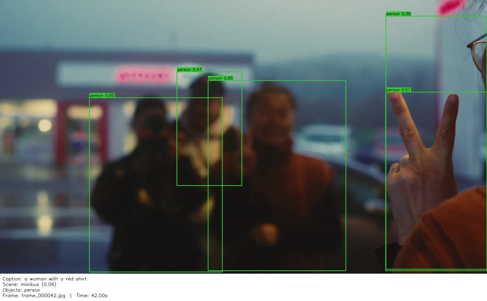
  

**Figure:** The same frame with different caption and scene detection — “minibus” (left) vs. “uncertain” (right).

  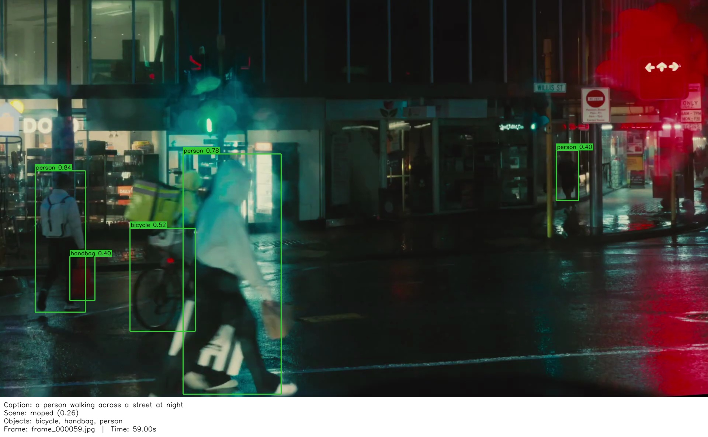
  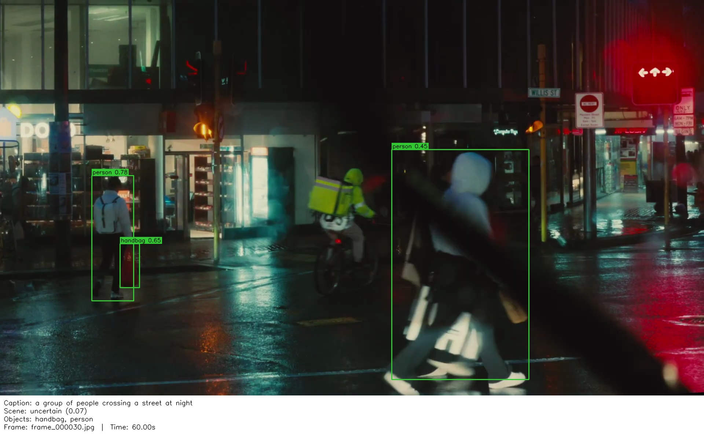

**Figure:** The same frame with different caption and scene detection — “moped” (left) vs. “uncertain” (right).

  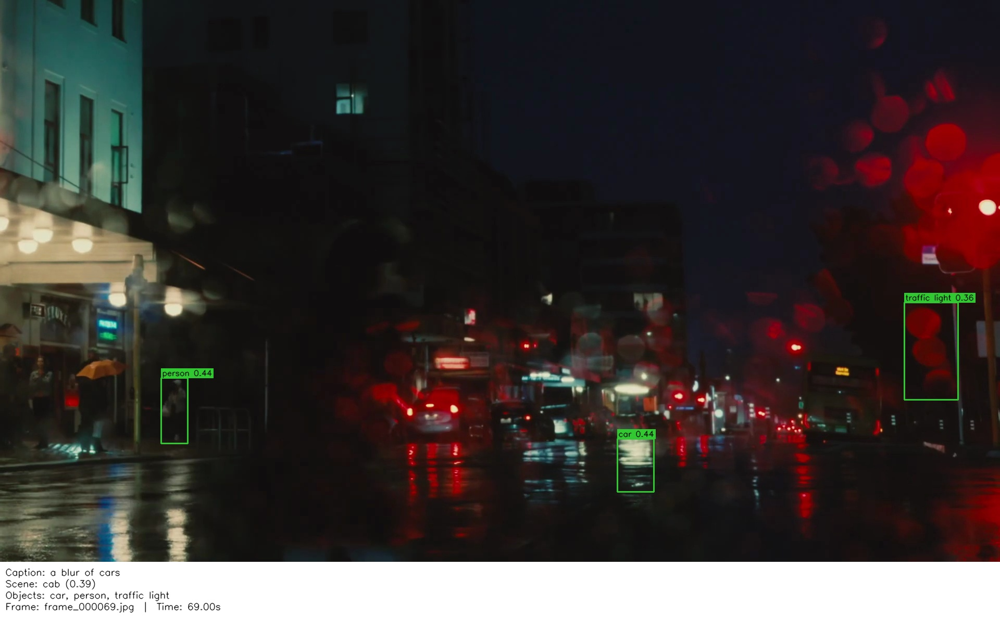
  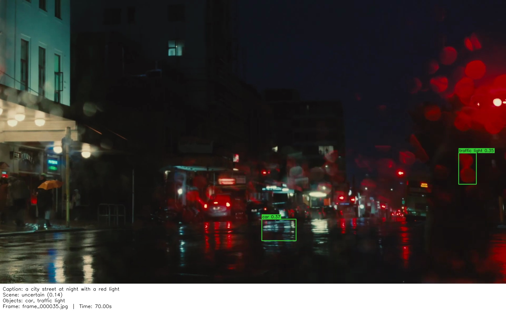

**Figure:** The same frame with different caption and scene detection — “cab” (left) vs. “uncertain” (right).

I actually prefer an uncertain label over a completely wrong one.
It honestly reflects that the model doesn’t know which, in practice, is far better than confidently incorrect predictions.

### Observations & Reflections

The more I looked at the results, the more I realized that the Places365 model was probably confused by domain.
The scenes in the video I chose are artistic, not documentary; they often contain reflections, close-ups, and blurred motion.
For a model trained mostly on daylight photos of clear environments, this is like asking someone to describe an abstract painting.
So instead of trying to “fix” it completely, I learned to build safety nets like lower thresholds, smoothing, and uncertainty handling.

### What Worked

- The confidence floor immediately stopped absurd outputs. 
- Smoothing gave continuity across similar frames.

### What Didn’t

- Even after smoothing, the model could not reliably distinguish indoor vs. outdoor in dim scenes. 
- The “uncertain” tag dominated the results for artistic or abstract clips. 
- True fine-tuning was not possible due to CPU and time constraints.

To conclude Task2, I'd say that:
- Models like Places365 work well only within their training distribution. 
- Low-confidence honesty beats confident error.
- Small models can still behave unpredictably, especially on abstract or edited visuals.

This part of the challenge also made me appreciate the difference between accuracy and reliability. I realized that my goal wasn’t to make the model perfect, but to make it trustworthy (which can definitely be improved even further).

With more time or GPU resources, I would have experimented with CLIP-based similarity or LLaVA for richer scene embeddings, but within CPU limits, I’m happy that the pipeline at least behaves predictably now.

### Additionally I also observed:
**Object Detection model bias (YOLOv8n):**
The YOLO model was trained on the COCO dataset, which includes a class called "tv" or "monitor", but does not have a class for "painting" or "picture frame".
So when it sees a rectangular object on a wall, especially with reflections and a dark border, it assumes it’s a TV because that’s the closest class it knows.
From the model’s perspective, that prediction is actually logical, not random.
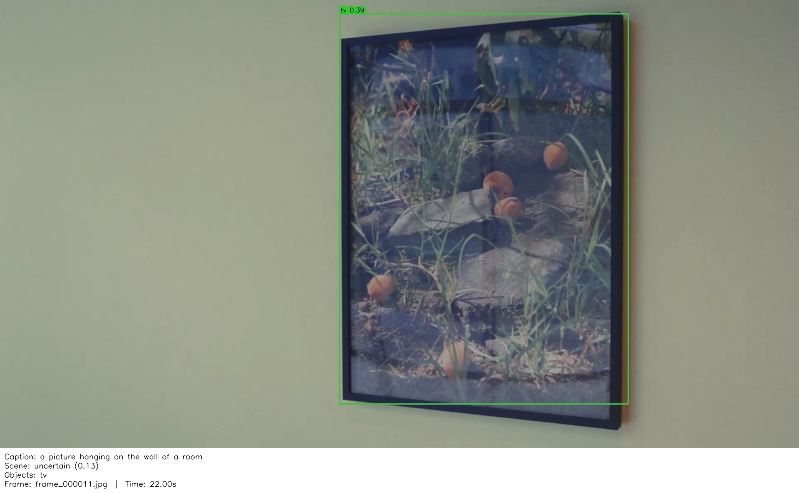

---

## Task 3 — Chatbot Integration

**Objective:**  
The goal of Task 3 was to demonstrate how information extracted in Tasks 1 and 2 such as captions, object detections, and scene classifications can be used to build a queryable knowledge base that supports interactive, natural-language questions about the video content.

| Step | Component | Purpose |
|------|------------|----------|
| **Build Knowledge Base** | Merge captions, objects, and scenes | Create a unified table (`knowledge_base.parquet`) describing each frame. |
| **Build Vector Index** | `sentence-transformers/all-MiniLM-L6-v2` + FAISS | Convert each frame description into embeddings and store them in a CPU-friendly FAISS index for similarity search. |
| **Query Interface** | Simple Python CLI | Let the user type text queries and retrieve the most relevant frames and captions. |
| **Run Task 3** | `python -m task3_chatbot_integration.run_task3 all` | Executes the full pipeline end-to-end. |

### Example Query and Result  

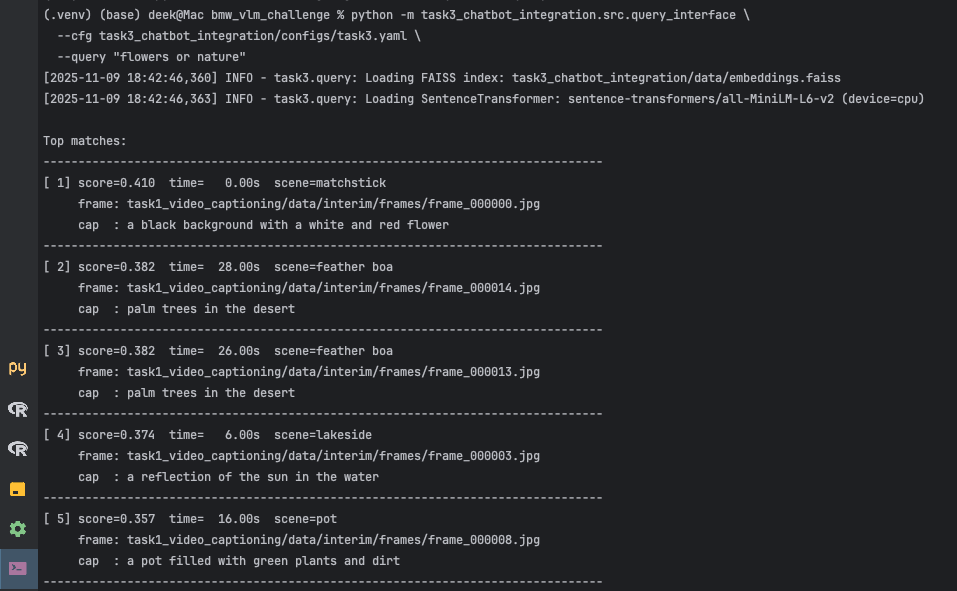

  
  
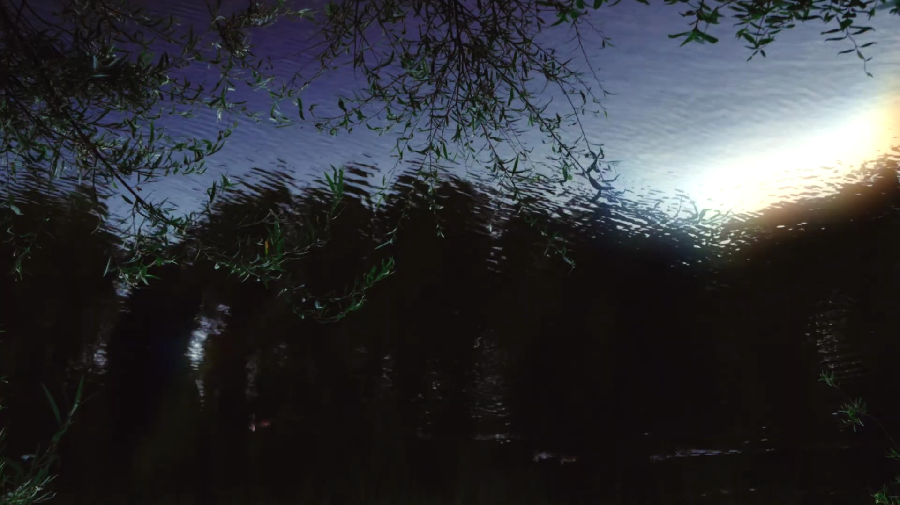
  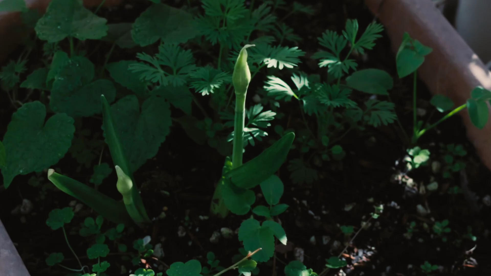

**Figure:** Output of Task 3 for query - "flowers or nature"

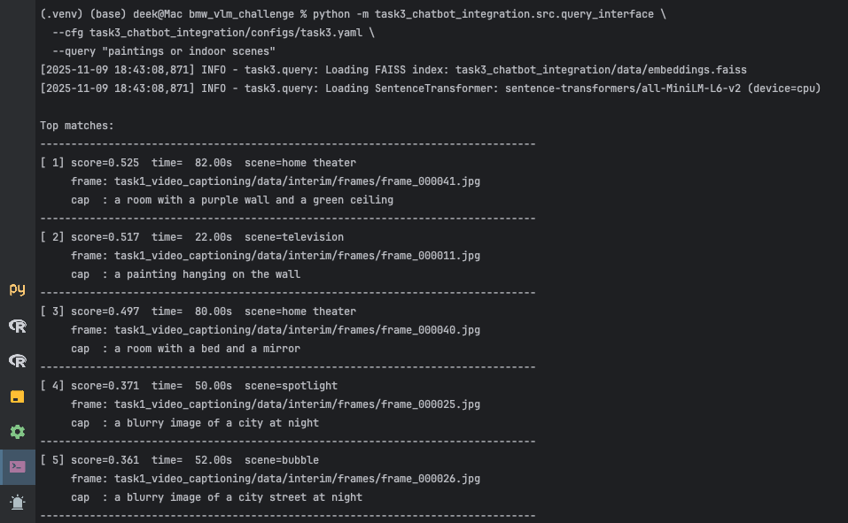

  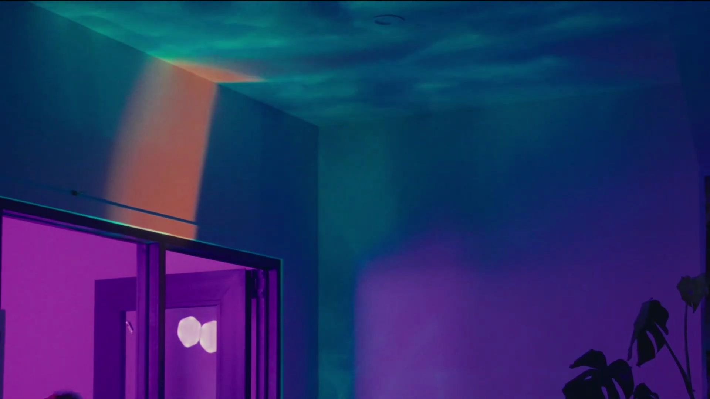
  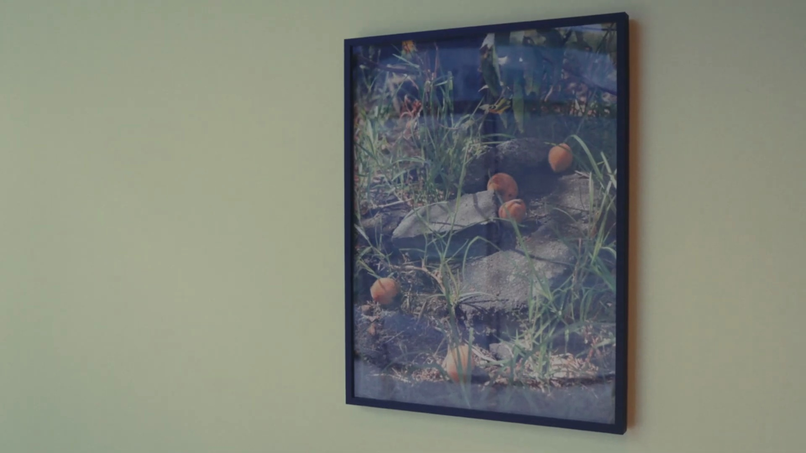
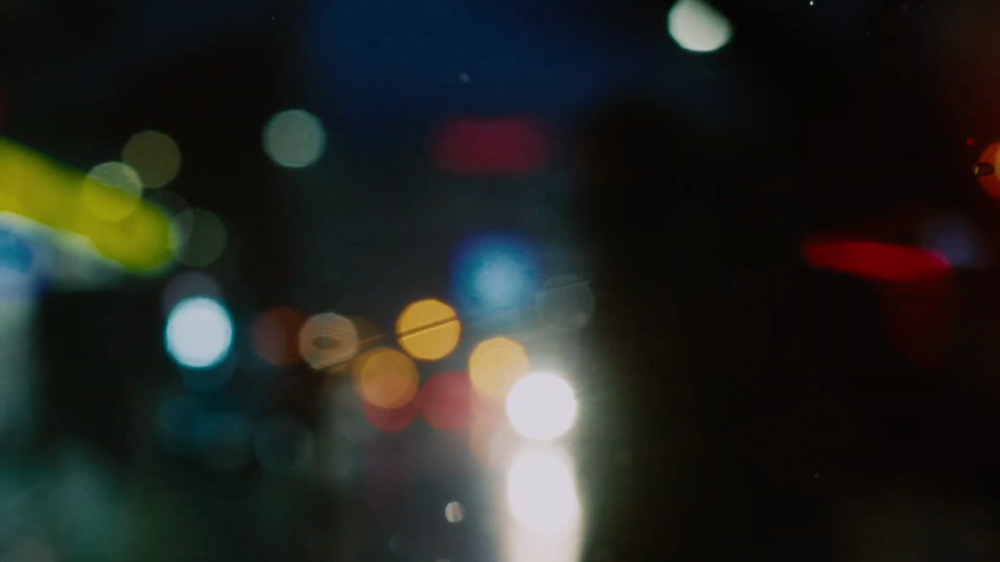
  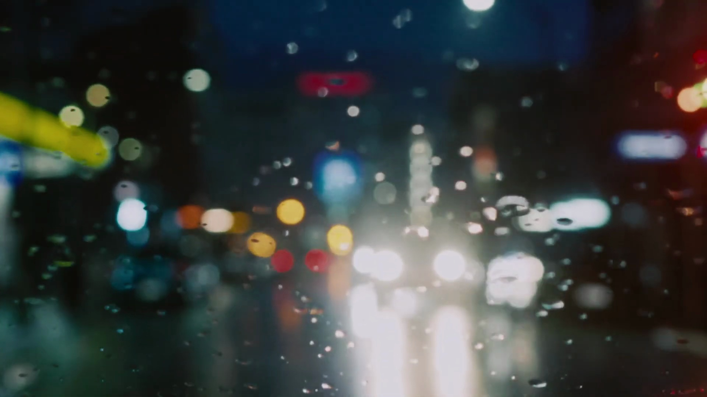

**Figure:** Output of Task 3 for query - "paintings or indoor scenes"

The retrieved frames and captions matched the meaning of my queries quite well, which shows that the model was actually able to understand what I was asking for. Even though the system is quite simple, it was really interesting to see how all the parts worked together in the end.

